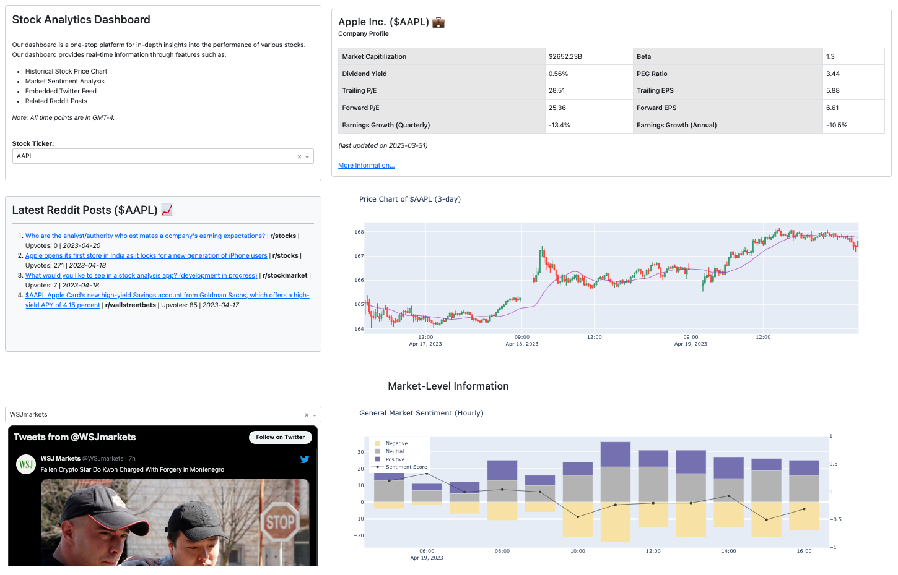
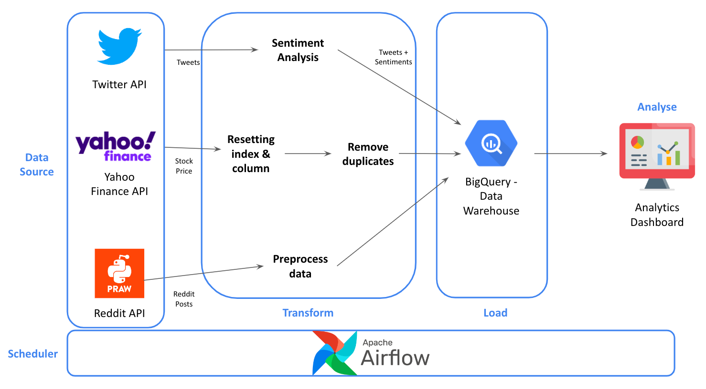
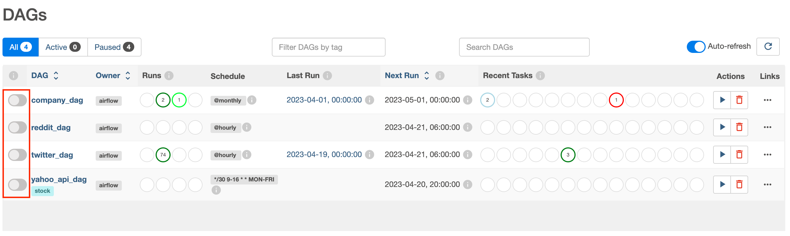

# Stock Analytics Dashboard

One-stop platform for investors to track the price statistics and related social media data for their stocks of interest. Focus on the top 30 US technology stocks by market capitalization.



## Data Pipeline Architecture



## Setup Guide

**Installation:**

1. Clone the GitHub repository to your directory of choice and navigate to the repository.
   - `git clone https://github.com/keiraaa-xrq/stock-analytics-dashboard.git`
   - `cd stock-analytics-dashboard`
2. Install _virtualenv_ and create a virtual environment.
   - `pip install virtualenv`
   - `virtualenv env`
3. Activate the virtual environment.
   - `source env/bin/activate`
4. Install the required packages.
   - `pip install -r requirements.txt`
5. Create a folder called **_key_** under **_stock-analytics-dashboard_**

**Set up BigQuery:**

1. Create a Google API Console project and enable BigQuery by referencing [this link](https://support.google.com/analytics/answer/3416092?hl=en#zippy=%2Cin-this-article).
2. Create a Google Cloud platform service account and grant that service account owner privileges.
3. Download the JSON file of the service account, rename it to `bigquery_key.json`, and place the file in the **_key_** folder.
4. Grant billing for the project by adding a payment method.

**Set up PRAW**

1. Obtain client ID & client secret for Reddit's API by referencing [this link](https://github.com/reddit-archive/reddit/wiki/OAuth2).
2. Create a JSON file following this format:

```
{
  "client_id": "your client id",
  "client_secret": "your client secret",
  "user_agent": "your user agent"
}
```

3. Rename the file to `reddit_key.json` and place the file in the **_key_** folder.

**Set up Airflow:**

1. Specify the home for Airflow as an environment variable.
   - `export AIRFLOW_HOME=$(pwd)/airflow`
2. Activate Airflow. This should create the configuration file `airflow.cfg` under the `airflow` directory.
   - `airflow version`
3. Go to `airflow.cfg` and change `load_examples` to `False`
4. Initialise Airflow, including inistialising the database, creating an user and starting the webserver.
   - `airflow standalone`
5. Start an instance of the Airflow Scheduler.
   - `airflow scheduler`
6. To run the scheduled DAGs, unpause the DAGs.
   

## Start the Dashboard

Run `python stock_analytics_dashboard.py`
